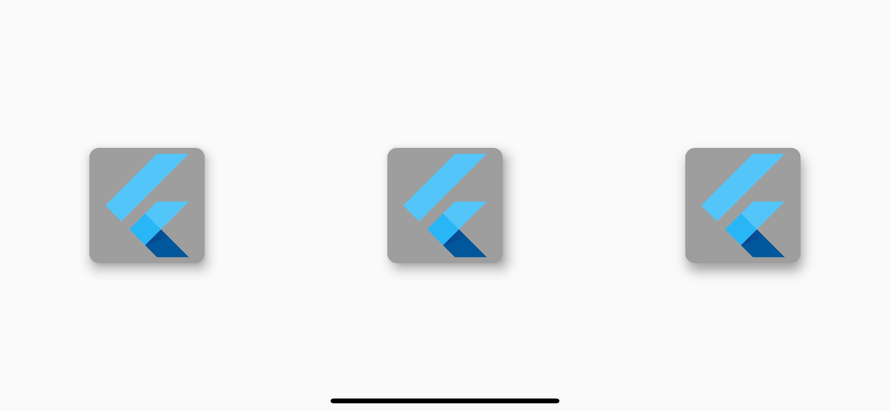

# Flutter Widget Guide
众说周知**Flutter**中一切皆为**Widget**，并且Widget之间还存在着嵌套组合的艺术，每个Widget可以功能单一，又可以将不同的Widget相互组合形成另一个Widget。然而这些Widget组合的结果就是，Weiget个数会成几何倍数增长，现在Widget个数怎么说也有500了吧。(这个是官方对Widget做的分类[Widget Catalog](https://flutter.dev/docs/development/ui/widgets)）。

那么怎么合理的组合Widget形成另一个Widget，官方的**Container**就是一个很好的例子，他很好的将LimitedBox、ConstrainedBox、Align、Padding、ClipPath、DecoratedBox、Transform等Widget组合到了一起，这里可以看下[源码](https://github.com/flutter/flutter/blob/master/packages/flutter/lib/src/widgets/container.dart#L244)感受一下。

无独有偶，实际上官方确实也组合了很多像Container一样好用的Widget。但是，也是因为Widget的可组合性太强了，同一个实现常常会有很多种的组合的方式。这就形成大家很喜欢自己造一些轮子的趋势，虽然也可以完成，但会出现很多相似的Widget。这样后期难以维护，所以建议大家优先使用官方的一些封装好的Widget。当然也有可能是刚入门，渐进式的使用Flutter，对Widget没有一个大概的了解，就不知不觉的走了弯路。

我呢开始也走了不少弯路，一边享受着Widget可以无限嵌套封装的快感，一边感到不知道到底应该选用哪个Widget的困惑。随着慢慢的了解，也渐渐的总结出了不同场景下，应该使用哪些Widget。

在这里把它分享出来，希望大家一起学习，一起探讨。以下都是我自己的主观认知，如有不对，还望指正。

## 概览

**详细可点击链接在官网查看对应Widget的文档以及演示(部分Widget已经有详细演示)**

|                        [功能](#演示)                | 优选 | 不推荐 | 描述
| :------: | :------: | :------: | ------ |
| 容器 | [Container](https://api.flutter.dev/flutter/widgets/Container-class.html) | LimitedBox、ConstrainedBox、Align、Padding、ClipPath、DecoratedBox、Transform | 功能这么多的Container用起来它不香吗，但是如果你只使用了**一个属性**，例如外边距，还是建议直接使用Padding。 |
| 容器动画 | [AnimatedContainer](https://api.flutter.dev/flutter/widgets/AnimatedContainer-class.html) | AnimatedXxxx | 每个属性都有单独的以Animated为前缀的隐式动画实现，但如果想让child使用动画请考虑使用[AnimatedSwitcher](https://api.flutter.dev/flutter/widgets/AnimatedSwitcher-class.html)。 |
| [容器内容居中](#容器内容居中) | 设置[Alignment](https://api.flutter.dev/flutter/painting/Alignment-class.html).**center** | Center | Container中不要再套用Center了，直接设置Alignment为center即可。|
| 比例容器 | [AspectRatio](https://api.flutter.dev/flutter/widgets/AspectRatio-class.html) | 手动计算宽或高 | 比列尽可能写成 2 / 3，而不是0.6667，不仅精度高而且易读。扩展：GridView中item的Size就是通过，副轴长度固定，然后按照比例算出主轴长度，来实现固定布局的。|
| [阴影](#阴影) | [PhysicalModel](https://api.flutter.dev/flutter/widgets/PhysicalModel-class.html)、[Card](https://api.flutter.dev/flutter/material/Card-class.html) | BoxShadow | 有多种实现方式，但是PhysicalModel术业有专工。 |
| 卡片效果 | [Card](https://api.flutter.dev/flutter/material/Card-class.html) | Material | Card的效果其实是使用Material进行了上层封装，想要实现卡片效果，直接使用Card即可。skr～ |
| 圆形头像 | [CircleAvatar](https://api.flutter.dev/flutter/material/CircleAvatar-class.html)、[ClipOval](https://api.flutter.dev/flutter/widgets/ClipOval-class.html) | ClipRRect | ClipRRect更适用于圆角，它的圆形只是一种特殊情况。ClipRRect虽是椭圆，但更常用它的圆形表达形式。CircleAvatar看到名字就不用太多解释了。 |
| 局部刷新 | [ValueNotifier](https://api.flutter.dev/flutter/foundation/ValueNotifier-class.html) & [ValueListenable**Builder**](https://api.flutter.dev/flutter/widgets/ValueListenableBuilder-class.html) | 自封装StatefulWidget | 多留意后缀是**Builder**的组件，有些功能其实官方已经有了封装，这等小事就不要再去造轮子了。 |
| 布局刷新 | [Layout**Builder**](https://api.flutter.dev/flutter/widgets/LayoutBuilder-class.html) |  | 👆 可用于Web页面做自适应布局。|
| 方向更改 | [Orientation**Builder**](https://api.flutter.dev/flutter/widgets/OrientationBuilder-class.html) |  | 👆移动设备方向改变触发布局更新。 |
| 单次异步 | [Future**Builder**](https://api.flutter.dev/flutter/widgets/FutureBuilder-class.html) |  | 👆 异步只能执行一次。 |
| 多次异步流 | [Stream**Builder**](https://api.flutter.dev/flutter/widgets/StreamBuilder-class.html) |  | 👆 可以向数据流中添加多次值，每次接收到数据后便刷新布局。 |
| 自定义动画 | [Animated**Builder**](https://api.flutter.dev/flutter/widgets/AnimatedBuilder-class.html) | AnimatedWidget | 👆 用于构建自定义动画，可以将动画Widget中不需要变化的部分放到child节点，优化动画性能。 |
| 自定义插间动画 | [TweenAnimation**Builder**](https://api.flutter.dev/flutter/widgets/TweenAnimationBuilder-class.html) | AnimatedWidget | 👆 使用与AnimatedBuilder类似，但其只是double类型的插间，而TweenAnimationBuilder可以指定插间类型，例如：Color、Offset、Rect等。 |
| 旋转 | [RotatedBox](https://api.flutter.dev/flutter/widgets/RotatedBox-class.html) | Transform.rotate | Transform旋转前后占用的空间不会变化：[一日] => [丨日]；RotatedBox是先旋转然后应用布局，所以不存在旋转框占用布局：[一日] => [旧] |
| 画布中旋转 | [RotationTransition](https://api.flutter.dev/flutter/widgets/RotationTransition-class.html) | Canvas.rotate在Canvas中旋转 | 可以在CustomPaint的画布上尽情作画，然后将旋转应用到这个Widget上，而不是驱动画布旋转，每次都计算角度偏移再重画一遍。 |
| 分割线 | [Divider](https://api.flutter.dev/flutter/material/Divider-class.html) | 用Border实现 | 快收起你的奇技淫巧，分割线不用这么麻烦，Divider就够了。如果你想用网格线可以使用[GridPaper](https://api.flutter.dev/flutter/widgets/GridPaper-class.html), 但它限定主线宽1pixel。想自定义线宽的话用这个[GridPaperExp](https://nomeleel.github.io/awesome_flutter/#/grid_paper_exp_view) |
| 待续 |  |  |  |


## 演示

### 容器内容居中

[动手尝试一波](https://nomeleel.github.io/flutter_widget_guide/container_text_centered/index.html)

```dart
// ✌️
Container(
  color: Colors.purple,
  alignment: Alignment.center,
  child: Text(text),
)
// 🙅‍♂️     
Container(
  color: Colors.blue,
  child: Center(
    child: Text(text),
  ),
)
```

### 阴影

[动手尝试一波](https://nomeleel.github.io/flutter_widget_guide/physical_model_card_shadow/index.html)

<div align="center">
    
</div>

```dart
// ✌️
PhysicalModel(
  color: Colors.grey,
  elevation: 10.0,
  shadowColor: Colors.grey[900],
  clipBehavior: Clip.hardEdge,
  borderRadius: borderRadius,
  child: child,
)
// ✌️
Card(
  color: Colors.grey,
  elevation: 10.0,
  shadowColor: Colors.grey[900],
  clipBehavior: Clip.hardEdge,
  shape: RoundedRectangleBorder(
    borderRadius: borderRadius,
  ),
  child: child,
)
// 🙅‍♂️ 
Container(
  clipBehavior: Clip.hardEdge,
  decoration: BoxDecoration(
    color: Colors.grey,
    borderRadius: borderRadius,
    boxShadow: <BoxShadow>[
      BoxShadow(
        color: Colors.grey,
        offset: Offset(2.0, 8.0),
        blurRadius: 10.0,
      )
    ],
  ),
  child: child,
),

```
